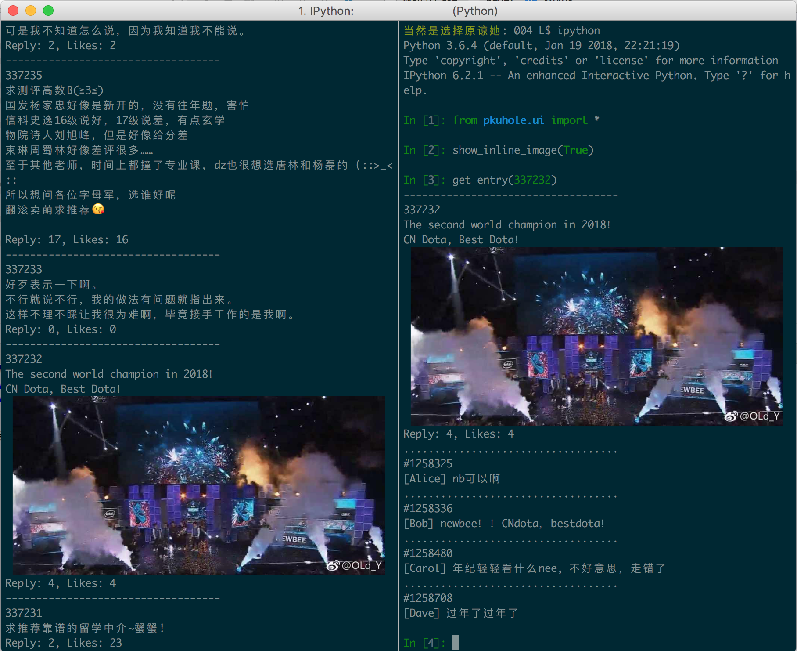

# PKU Hole

[TOC]

This is a package to read PKU Hole.
You can play with it in python's interactive mode.

PKU Hole is a place for PKU students to share their ideas anonymously.

## General Usage

+ All the functions you will need are in `pkuhole.ui`

+ Run `get_list()` to fetch a new list of messages.

+ Run `get_entry(pid)` to see the comments below a certain message.

+ Run `show_debug_info(True)` to see the debug information, which is turned off by defualt.

+ If you are using [iterm2](https://www.iterm2.com/index.html) on macOS, you can see inline images by running `show_inline_image(True)`, which is turned off by default.

## Demo Usage

Have fun.
